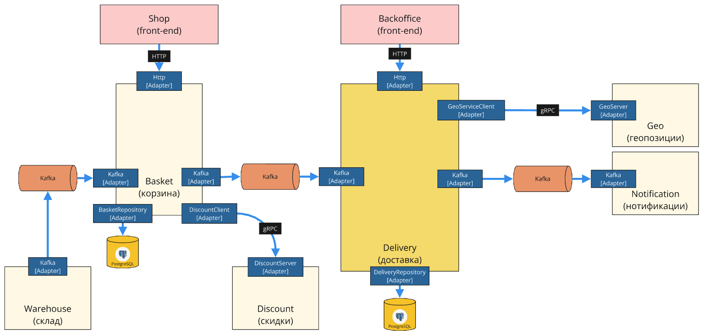

# Delivery Microservice

A production-ready Delivery Microservice built with **Go 1.26**, designed according to **Domain-Driven Design (DDD)**, **Clean Architecture / Hexagonal Architecture (Ports and Adapters)**, **CQRS**, and **Event-Driven Architecture**.

---

## Architecture Overview



The service is divided into distinct architectural layers with strict dependency inversion:

- **Domain Layer (`internal/core/domain`)**: Contains core business logic and invariants free of external frameworks or database drivers.
  - **Aggregates**: `Courier`, `Order`.
  - **Entities & Value Objects**: `StoragePlace`, `Location`.
  - **Domain Events**: `CompletedDomainEvent`.
  - **Domain Services**: `OrderDispatcher` (matches orders to couriers optimizing for capacity and travel distance).
- **Application Layer (`internal/core/application`)**: Implements use cases organized by CQRS:
  - **Commands**: `CreateOrder`, `CreateCourier`, `MoveCourier`, `MoveCouriers`, `CompleteOrder`, `AssignOrder`, `ProcessBasketConfirmed`.
  - **Queries**: `GetBusyCouriers`, `GetNotCompletedOrders`.
  - **Event Handlers**: Mediatr handlers that react to domain events.
- **Ports (`internal/core/ports`)**: Abstract interfaces for repositories, Unit of Work, Kafka producer, and gRPC clients.
- **Adapters (`internal/adapters`)**:
  - **Primary / Inbound**:
    - HTTP server (`Echo v4`, OpenAPI generated via `oapi-codegen`).
    - Kafka Consumer (consumes `basket.confirmed` events via pure-Go `franz-go`).
  - **Secondary / Outbound**:
    - PostgreSQL repositories via GORM and transactional `UnitOfWork`.
    - Kafka Producer (publishes `OrderCompletedIntegrationEvent` via `franz-go`).
    - gRPC Geo Client (resolves street names to coordinate locations).
- **Jobs (`internal/jobs`)**: Background scheduler (`gocron`) running:
  - Courier movement simulation.
  - Order assignment dispatcher.
  - Transactional Outbox publisher.

---

## Tech Stack

| Technology | Purpose |
| :--- | :--- |
| **Go 1.26** | Programming language |
| **Echo v4** | High-performance HTTP server |
| **GORM & PostgreSQL** | ORM, persistence, and transactional Unit of Work |
| **franz-go** | Pure Go Apache Kafka client (zero CGO) |
| **gRPC & Protobuf** | Inter-service communication with Geo service |
| **oapi-codegen** | OpenAPI 3.0 specification code generation |
| **gocron v2** | In-process job scheduling |
| **Testcontainers-Go** | Integration tests with real PostgreSQL & Kafka containers |
| **golangci-lint v2** | Static analysis and linting |

---

## Makefile Commands

### Building & Running

```bash
# Run unit tests
make test

# Run integration tests (requires Docker / Testcontainers)
make test-integration

# Build static binary (CGO=0)
make build

# Run code linter
make lint

# Start full Docker Compose stack (project "shop")
make stack

# Stop full Docker Compose stack
make stack-down
```

### Code Generation

```bash
# Generate all contracts
make generate

# Generate HTTP server from OpenAPI specification
make generate-server

# Generate gRPC client from Protobuf specification
make generate-grpc-clients

# Generate Kafka queue message contracts from Protobuf
make generate-queues
```

---

## Docker & Local Setup

### 1. Start Full Application Stack

You can launch all services (PostgreSQL, Kafka, Backoffice UI, Geo, Discount, Basket, Delivery) using the convenience Makefile target:

```bash
make stack
```

*(Under the hood, this executes `docker compose -p "shop" -f docker/docker-compose.yml up -d`)*

To stop and remove all containers and volumes:
```bash
make stack-down
```

This starts:
- **Delivery Service** (`http://localhost:8082`)
- **Backoffice Frontend** (`http://localhost:8086`)
- **PostgreSQL 18** (`localhost:5432`)
- **Apache Kafka** (`localhost:9092`)
- **Kafbat UI** (`http://localhost:8080`)
- Mock upstream services (**Geo Service**, **Discount Service**, **Fake Basket**)

### 2. Run Application Locally

```bash
go run ./cmd/app
```

The HTTP server will listen on `http://localhost:8082`.

Health check:
```bash
curl http://localhost:8082/health
```

---

## Useful Database Queries

```sql
-- Inspect current data
SELECT * FROM public.assignments;
SELECT * FROM public.couriers;
SELECT * FROM public.orders;
SELECT * FROM public.outbox;
SELECT * FROM public.inbox;

-- Clean database tables (excluding dictionaries)
DELETE FROM public.assignments;
DELETE FROM public.couriers;
DELETE FROM public.orders;
DELETE FROM public.outbox;
DELETE FROM public.inbox;
```
